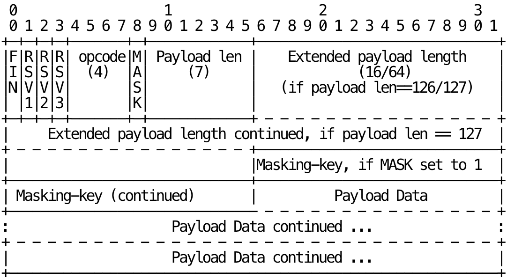

<!-- slide -->
# WebSocket


A communication protocol on the transport layer, similar to HTTP.

<!-- slide -->
<div class="columns">


- Main idea
- Features
- Connection process
- Usage
- Drawbacks
- Future

</div>

<!-- slide -->
## Main idea

TCPConnection in HTML5 spec
([link](https://www.w3.org/TR/2008/WD-html5-20080610/comms.html#tcp-connections))

<div class="columns">


<div class="flex-vert-center">

➕
</div>

<div class="flex-vert-center">

**T**ransmission **C**ontrol **P**rotocol
</div>
</div>

- <!-- .fragment -->Bidirectional communication

<!-- slide -->
## Features

- <!-- .fragment -->
    HTTP compatibility
    
    - Same ports as HTTP: bypass most firewalls
    
- <!-- .fragment -->Low overhead 🐁
    - Single TCP connection <span class="plain">⏚</span>
    - Small header
        
- <!-- .fragment -->Full-duplex communication ↹
    - Server push
        

<!-- slide -->
## Connection process

- Opening handshake
- Messages
- Closing handshake: each side send one Close frames

<!-- slide -->
### Opening handshake

- <!-- .fragment -->Client request using HTTP 1.1

    ```http
    GET /chat HTTP/1.1
    Upgrade: websocket
    Connection: Upgrade
    Sec-WebSocket-Key: dGhlIHNhbXBsZSBub25jZQ==
    ```

<!-- slide -->
- Server respond 101 Switching Protocols

    ```http
    HTTP/1.1 101 Switching Protocols
    Upgrade: websocket
    Connection: Upgrade
    Sec-WebSocket-Accept: s3pPLMBiTxaQ9kYGzzhZRbK+xOo=
    ```

- <!-- .fragment -->
    `Sec-WebSocket-Key` and `Sec-WebSocket-Accept` for security validation

- <!-- .fragment -->Connection upgrade

<!-- slide -->
### Messages

Units of data transferred

- <!-- .fragment -->Payload from client always masked;
    payload from server never masked
- <!-- .fragment -->
    WebSocket framing protocol
    ([source](https://www.rfc-editor.org/rfc/rfc6455#section-5.2))

<!-- slide -->


<!-- slide -->
#### WebSocket framing protocol

- <!-- .fragment -->
    `Opcode`: 4-bit operation code for frame type/ ping/ connection close
- <!-- .fragment -->
    `Mask`: `0b1` when `Payload Data` is masked using `Masking-key`
- <!-- .fragment -->
    `Payload len`: 7-bit unsigned integer for `Payload Data` length
    - <!-- .fragment -->If 126, following 16-bit unsigned integer is used
    - <!-- .fragment -->If 127, following 64-bit unsigned integer is used

<!-- slide -->
#### Small header

- <!-- .fragment -->
    2B (no mask) or 6B (mask) for small payload (0 ~ 125B)\
    ⇒ 1.6% ~ 100% overhead
- <!-- .fragment -->
    4B or 8B for 126B ~ 256kiB payload\
    ⇒ 0.006% ~ 6.3% overhead

<!-- slide -->
## Usage

- <!-- .fragment -->Alternative to HTTP AJAX requests
    - E.g. LiveView vs Hotwire

<div class="columns fragment">

[](http://localhost:4000/dashboard/home)

<div class="flex-vert-center">
<span class="plain">VS</span>
</div>

[](http://127.0.0.1:3000/posts/3)
</div>

<!-- slide -->
## Drawbacks

- <!-- .fragment -->Stateful
    - Complexity on server
        
- <!-- .fragment -->Tricky deployment
    ([example](https://www.reddit.com/r/django/comments/10q78lz/comment/j7ldxna/?utm_source=share&utm_medium=web2x&context=3))

<!-- slide -->
## Future

- <!-- .fragment -->Increased adoption in server side interactive framework
    - [tRPC](https://trpc.io/docs/subscriptions)
        
    - [HTMX](https://htmx.org/docs/#websockets-and-sse)
        
- <!-- .fragment -->Framework do the heavy lifting
    
    - Hide complexity from framework users

<!-- slide -->
## References

- [IETF RFC 6455](https://www.rfc-editor.org/rfc/rfc6455)
- [WebSocket - Wikipedia](https://en.wikipedia.org/wiki/WebSocket)

<style>
.columns {
    display: grid;
    gap: 2rem;
    grid-auto-flow: column;
}

.flex-vert-center {
    display: flex;
    flex-direction: column;
    height: 100%;
    width: 100%;
    justify-content: center;
}

.line-height-1 {
    line-height: 1;
}

.plain {
    font-family: Arial;
}

.reveal pre {
    width: 100%;
}

.reveal img {
    margin: 0 0;
}

.reveal li > img {
    height: 35px;
}
</style>
